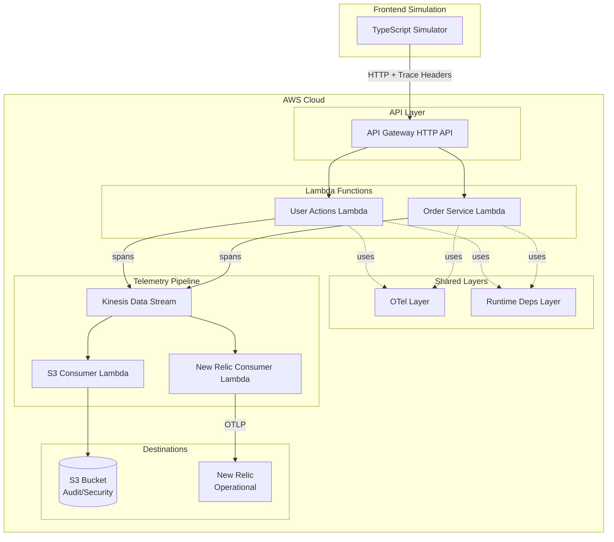

# OpenTelemetry Demo

A complete end-to-end OpenTelemetry demonstration on AWS, showing how to instrument applications, collect telemetry, and export to multiple destinations for security/audit and operational observability.

## Architecture



## Features

- **Distributed Tracing**: Full trace propagation from simulator through API Gateway to Lambda functions
- **Custom Span Attributes**: User ID, org ID, and action type on every span for security context
- **Dual Export**: Kinesis Data Streams fan-out to both S3 (audit) and New Relic (operational)
- **Shared Instrumentation**: Lambda layer for consistent OTel setup across functions
- **Infrastructure as Code**: OpenTofu with GitLab-managed state

## Components

| Component | Description |
|-----------|-------------|
| `simulator/` | TypeScript CLI that simulates user actions |
| `backend/functions/` | FastAPI Lambda functions with Powertools |
| `layers/otel-common/` | Shared OTel instrumentation layer |
| `layers/runtime-deps/` | Shared runtime dependencies layer |
| `infra/` | OpenTofu modules for AWS infrastructure |

## Prerequisites

- [OpenTofu](https://opentofu.org) >= 1.6
- [glab CLI](https://gitlab.com/gitlab-org/cli) >= 1.66 (for GitLab state backend)
- [AWS CLI](https://aws.amazon.com/cli/) with valid credentials
- Python 3.11+
- Node.js 20+

## Quick Start

### 1. Clone and Configure

```bash
git clone <repository-url>
cd otel-example

# Copy and customize tfvars
cp infra/environments/dev/terraform.tfvars.example \
   infra/environments/dev/terraform.tfvars

# Edit terraform.tfvars with your settings
```

### 2. Configure AWS Credentials

Use any standard AWS authentication method:

```bash
# Option 1: Environment variables
export AWS_ACCESS_KEY_ID=...
export AWS_SECRET_ACCESS_KEY=...

# Option 2: AWS profile
aws configure

# Option 3: AWS SSO
aws sso login --profile your-profile
export AWS_PROFILE=your-profile
```

### 3. Deploy Infrastructure

```bash
# Build Lambda layers
make build-layers

# Initialize OpenTofu with GitLab state
make init

# Preview changes
make plan

# Deploy
make apply
```

### 4. Set Up New Relic (Optional)

Create a free New Relic account at [newrelic.com/signup](https://newrelic.com/signup).

**Required API Key Scope:**
- Key type: **Ingest - License** (not User API Key)
- This key allows sending telemetry data to New Relic

Store the API key in AWS SSM Parameter Store:

```bash
./scripts/setup-newrelic.sh
```

Or manually:

```bash
aws ssm put-parameter \
  --name "/otel-demo/newrelic/api-key" \
  --type "SecureString" \
  --value "YOUR_INGEST_LICENSE_KEY"
```

### 5. Run the Simulator

```bash
cd simulator
npm install

# Get the API Gateway URL from terraform output
API_URL=$(cd ../infra && tofu output -raw api_gateway_url)

# Run all scenarios
npm run simulate -- --url "$API_URL" --scenario all

# Or specific scenarios
npm run simulate -- --url "$API_URL" --scenario login
npm run simulate -- --url "$API_URL" --scenario order
npm run simulate -- --url "$API_URL" --scenario browse
```

### 6. View Telemetry

**S3 (Audit Logs):**
```bash
BUCKET=$(cd infra && tofu output -raw audit_bucket_name)
aws s3 ls "s3://$BUCKET/telemetry/" --recursive
```

**New Relic:**
1. Go to [one.newrelic.com](https://one.newrelic.com)
2. Navigate to APM & Services or Distributed Tracing
3. Search for `otel-demo` services

## Project Structure

```
otel-example/
├── backend/
│   ├── functions/
│   │   ├── user_actions/      # Track user actions API
│   │   ├── order_service/     # Order management API
│   │   ├── consumer_s3/       # Write spans to S3
│   │   └── consumer_newrelic/ # Export spans to New Relic
│   └── shared/                # Pydantic models and schemas
├── layers/
│   ├── otel-common/           # OTel SDK and Kinesis exporter
│   └── runtime-deps/          # FastAPI, Powertools, etc.
├── simulator/                 # TypeScript action simulator
├── infra/
│   ├── modules/
│   │   ├── api-gateway/
│   │   ├── kinesis/
│   │   ├── lambda/
│   │   ├── otel-layer/
│   │   ├── runtime-layer/
│   │   └── s3/
│   └── environments/dev/
└── scripts/
    ├── deploy.sh
    ├── destroy.sh
    └── setup-newrelic.sh
```

## API Endpoints

| Method | Path | Description |
|--------|------|-------------|
| POST | `/actions` | Create a user action |
| GET | `/actions/{id}` | Get a user action |
| POST | `/orders` | Create an order |
| GET | `/orders/{id}` | Get an order |

All endpoints require headers:
- `X-User-Id`: User identifier
- `X-Org-Id`: Organization identifier
- `X-Session-Id`: (Optional) Session identifier

## Span Attributes

Every span includes these standard attributes for security and audit:

| Attribute | Description |
|-----------|-------------|
| `user.id` | User identifier |
| `org.id` | Organization identifier |
| `action.type` | Action type (e.g., `order.create`) |
| `action.timestamp` | ISO8601 timestamp |
| `session.id` | Session identifier (optional) |
| `client.ip` | Client IP address (optional) |

## Cost Considerations

For development/learning (a few hours of usage):

| Service | Estimated Cost |
|---------|----------------|
| Lambda | Free tier (1M requests/month) |
| API Gateway | Free tier (1M requests/month) |
| Kinesis (on-demand) | ~$0.04/hr + data |
| S3 | < $0.01 |
| New Relic | Free tier (100GB/month) |

**Estimated total: $1-5/day** if left running.

Run `make destroy` when done to avoid ongoing costs.

## Cleanup

```bash
# Destroy all AWS resources
make destroy

# Or use the script with confirmation
./scripts/destroy.sh
```

## License

MIT
